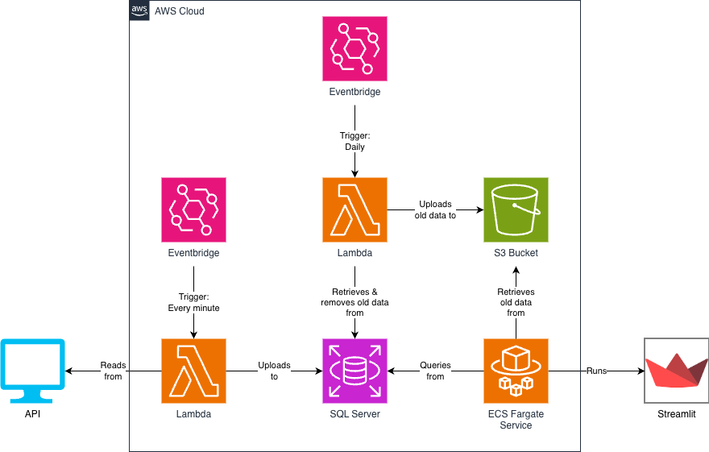
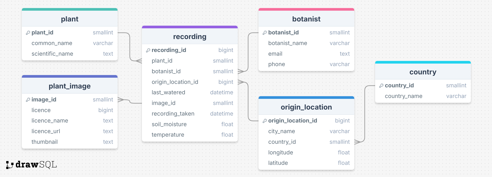

# 🌱 Liverpool Museum of Natural History Plant Monitoring 
A fully-functioning, end-to-end ETL pipeline and dashboard which cleans, transforms, and analyses real-time recordings of the moisture and temperature levels of the plants in the Liverpool Museum of Natural History (LMNH).

## Introduction 🌷
The gardeners at the LMNH want to be able to monitor the health of their plants over time. This project provides a solution to this by building an ETL pipeline that takes in the readings from the temperature and moisture sensors within the garden and analyses these recordings for all the plants. 

## Getting Started 🏁🌴
Firstly, you must be signed into AWS. Ensure you have the [aws command line](https://aws.amazon.com/cli/) installed on your local machine, and then run the command `aws login`. This should open an AWS window on your default browser, and you should select the account to authenticate.

The entire project, beginning with running the terraform, building the docker images and pushing them to AWS, to allow for the pipeline and dashboard to be run on the cloud, can simply be started by running the `start.sh` script. Simply run the following command:

```
sh start.sh
```

and watch your pipeline and dashboard blossom!

## Project Structure 📂🪷

```text
├── archive/
│   └── archive.py
│
├── dashboard/
│   ├── load_data.py
│   ├── charts.py
│   ├── dashboard.py
│   └── pages/
│       └── archive_page.py
│
├── pipeline/
│   ├── extract.py
│   ├── transform.py
│   ├── load.py
│   └── pipeline.py
│
└── terraform/
    └── main.tf
```

## Architecture Diagram & ERD 🧩🪷






## Data Source 📊🌱
The data source from which this pipeline extracts recordings is this [API](https://tools.sigmalabs.co.uk/api/plants/8)

Ⓒ Charn Group (Basil, Fariha, Omar Y, Sam)